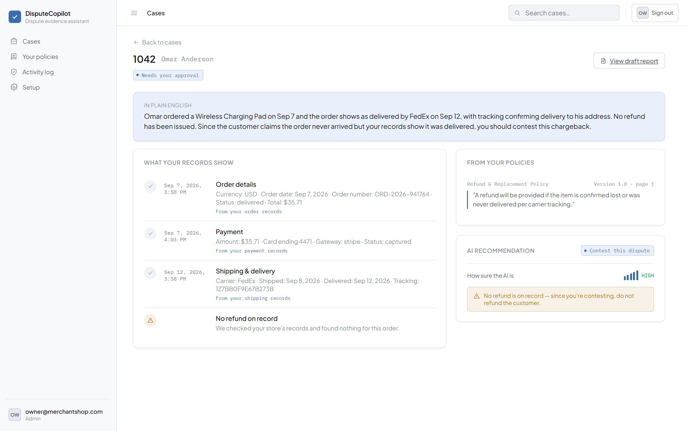
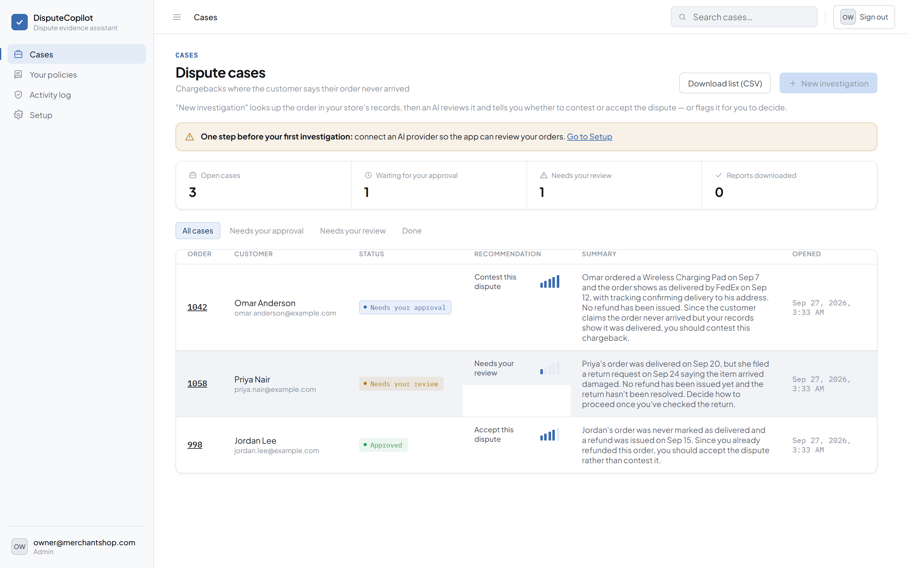
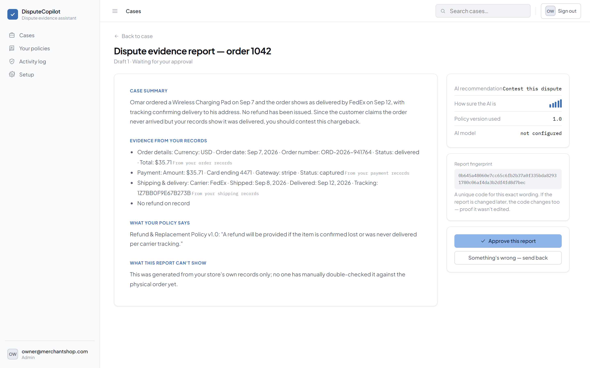
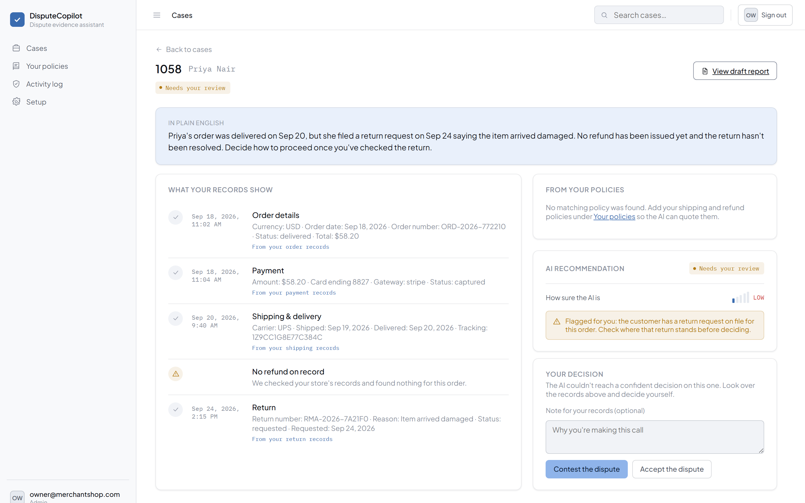
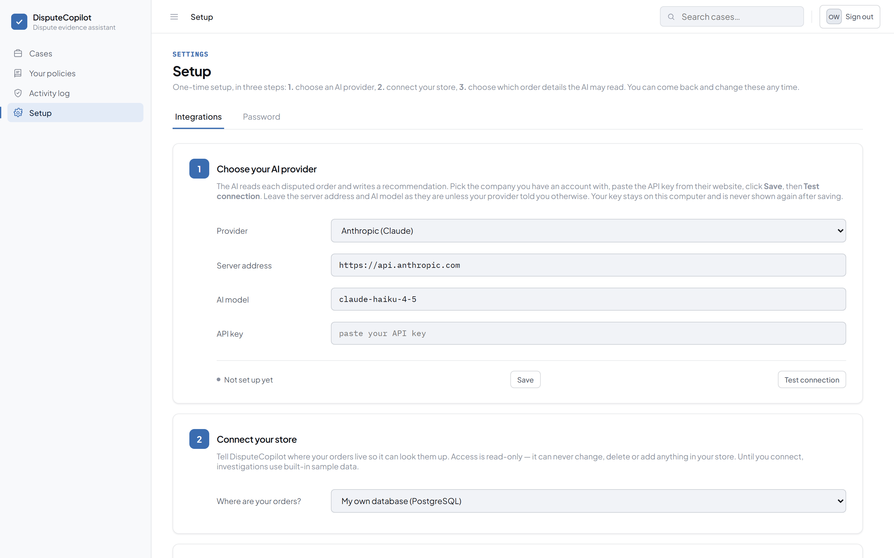
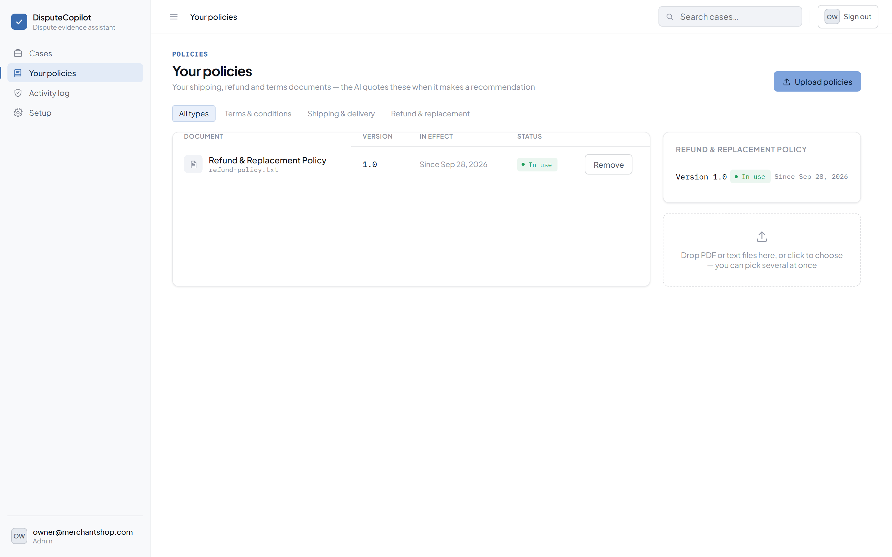
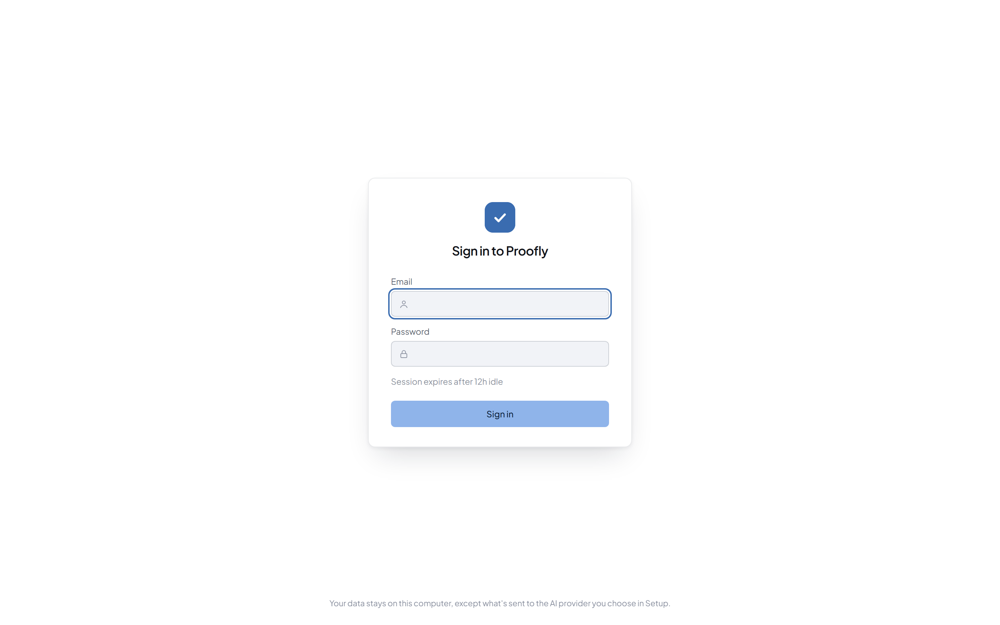
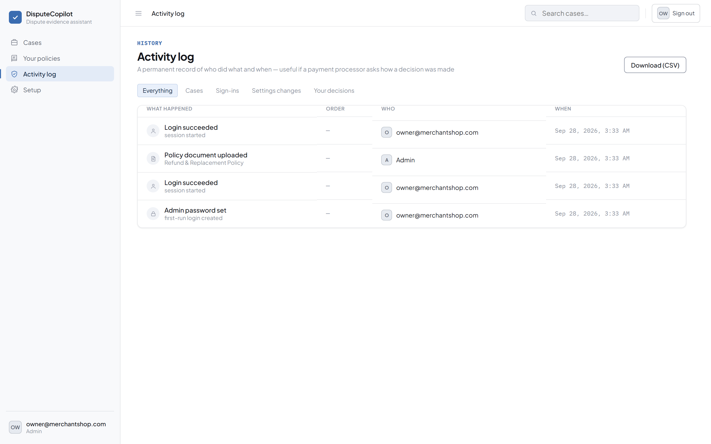

<div align="center">


# Proofly

**Stop losing "item not received" chargebacks to guesswork.**

Self-hosted. Runs on your machine. Your order data never leaves your business unless you choose to send it to an AI provider.

[Features](#features) · [How it works](#how-it-works) · [Screenshots](#screenshots) · [Install](#install-windows) · [Run from source](#run-from-source) · [Security](#security--privacy) · [📄 Product Overview PDF](docs/Proofly-Product-Overview.pdf)

</div>

---
> Proofly's recommendations are generated by an AI model and are provided for informational purposes only. They are not legal, financial, or payment-processor advice. You are solely responsible for reviewing all evidence and for your own dispute decisions. See LICENSE for the full disclaimer of warranty and limitation of liability.

## The problem

A customer disputes a chargeback claiming their order never arrived. You have maybe 48 hours to reply to your payment processor with proof — and the proof (order record, payment, tracking, refund history, your own return policy) is scattered across your database, your policy PDF, and your own memory of what usually happens.

Most merchants either lose disputes they should have won, or spend twenty minutes per case digging through tables by hand.

## What Proofly does

Type an order ID. Proofly:

1. **Reads your own order database** (or Shopify) — order, payment, fulfillment, refunds, returns, customer messages — through a connector that is **read-only by construction** and restricted to an admin-approved allowlist of tables and columns.
2. **Retrieves the relevant clause** from your uploaded shipping/refund/terms policies.
3. **Asks an AI model** (Claude, GPT, or a local model) to weigh the evidence against your policy and recommend **Contest** or **Accept** — with a confidence score and a plain-English explanation a non-technical shop owner can actually read.
4. **Flags anything it isn't sure about** for you to decide by hand, rather than guessing.
5. Produces a **draft evidence report** you review, approve, and download as a PDF to submit to your payment processor.

Every recommendation is checked against your own records before it's shown to you — see [How it works](#how-it-works).

## Features

- **Plain-English case review** — not a table dump. "Omar ordered a Wireless Charging Pad on Sep 7 and the order shows as delivered by FedEx on Sep 12... you should contest this chargeback."
- **Policy-grounded citations** — the AI quotes your actual refund policy, not a generic one, and every quote is verified against the document text before being shown.
- **A safety net that doesn't trust the AI blindly** — if the model recommends contesting an order your own records show was refunded, the app overrides it and routes the case to manual review instead. Same for an unresolved return request.
- **Works with your real schema** — a setup wizard (with an AI-assisted "suggest a mapping" step) maps Proofly's generic roles (orders, payments, refunds, returns...) onto whatever your tables and columns are actually called, including customer names that live in a separate `customers` table.
- **Read-only, allowlisted, injection-safe connector** — the app can never write to your database, and every table/column name is validated against your live schema before it's used in a query.
- **Bring your own AI provider** — Anthropic, OpenAI-compatible APIs, or a local model (e.g. Ollama). Your API key is encrypted at rest with a key unique to your install.
- **Full audit trail** — every login, setup change, and decision is logged for compliance.
- **One-click PDF export** of the approved report, ready to attach to your payment processor's dispute response.
- **Backup and restore** — download every case, policy, and setting as a single zip from Setup, and restore it (to the same machine or a fresh one) just as easily. All data otherwise lives only on this computer.
- **Ships as a single Windows installer** — no Docker, no separate database to install. See [Install](#install-windows).

## How it works

```
┌─────────────┐     order ID      ┌──────────────────────┐
│   Merchant  │ ────────────────▶ │   Proofly             │
└─────────────┘                   │                       │
                                   │  1. Read-only,        │
                                   │     allowlisted read  │───▶  Your database
                                   │     of order records  │      (or Shopify)
                                   │                       │
                                   │  2. Retrieve matching │───▶  Your policy
                                   │     policy excerpt    │      documents
                                   │                       │
                                   │  3. AI review against │───▶  Claude / GPT /
                                   │     evidence + policy │      local model
                                   │                       │
                                   │  4. Deterministic     │
                                   │     safety-net check  │
                                   │     (contradicts the  │
                                   │     merchant's own    │
                                   │     records? → human) │
                                   └──────────┬────────────┘
                                              ▼
                                   Contest / Accept / Needs your review
                                   + plain-English summary + citations
                                              ▼
                                   You approve → downloadable PDF
```

The safety net matters: an LLM can be confidently wrong. Proofly cross-checks the AI's recommendation against facts the connector itself read — has a refund actually been issued? Is there an open return request? — and overrides the AI rather than trusting it when the two disagree.

## Screenshots

<table>
<tr>
<td width="50%">

**Case review — plain English, not a table dump**



</td>
<td width="50%">

**Dashboard — every case at a glance**



</td>
</tr>
<tr>
<td width="50%">

**Draft report — ready to submit**



</td>
<td width="50%">

**When the AI isn't sure, a human decides**



</td>
</tr>
<tr>
<td width="50%">

**Setup — connect your store, no SQL required**



</td>
<td width="50%">

**Your policies — upload once, cited automatically**



</td>
</tr>
</table>

<details>
<summary>Sign-in and audit log</summary>
<br>

 

</details>

> Screenshots use synthetic demo data (a local test database), not any real merchant's records.

## Install (Windows)

Proofly ships as a single installer with an embedded database — nothing else to set up.

1. Download the latest `Proofly-Setup-*.exe` from [Releases](../../releases).
2. Run it and accept the Windows admin prompt (needed once, for install/uninstall).
3. On first launch, create your own admin password — every install gets its own password and its own encryption key, there is no shared default login.
4. Open **Setup** and connect your database (or Shopify) and an AI provider.

Your data — cases, audit log, and the local database — lives in `%LOCALAPPDATA%\Proofly`, untouched by future upgrades or uninstalls. Upgrading from a DisputeCopilot install migrates this folder automatically.

## Run from source

Requires Java 21, Node 18+, and Docker (for a local Postgres).

```bash
docker compose up -d          # Postgres on localhost:5432
cd backend && ./mvnw spring-boot:run    # http://localhost:8080
cd frontend && npm install && npm run dev   # http://localhost:5173
```

Run the backend test suite:

```bash
cd backend && ./mvnw test
```

To build the Windows installer yourself (requires the JDK's `jpackage` and [WiX Toolset](https://wixtoolset.org/) v3):

```bash
bash scripts/package-windows.sh
```

## Stack

| Layer | Technology |
|---|---|
| Backend | Java 21, Spring Boot 4, Spring Security, PostgreSQL, Flyway |
| Frontend | React, TypeScript, Vite |
| AI | Direct HTTP to Anthropic / OpenAI-compatible endpoints (including local models via Ollama) — no framework lock-in |
| Policy retrieval | Keyword-overlap scoring over uploaded documents — no vector database required |
| Packaging | jpackage + embedded PostgreSQL, bundled into one WiX-built Windows installer |

## Security & privacy

- **Read-only connector.** The database connection is opened with `setReadOnly(true)`; the app cannot write to your store's database even if it tried.
- **Allowlisted, injection-checked.** Only admin-approved tables/columns can be read, every identifier is re-validated against the live schema before use, and identifiers are checked against a strict pattern before ever reaching a SQL string.
- **Encrypted secrets, per-install key.** Your AI provider's API key is encrypted at rest (AES-GCM) under a key generated uniquely for your install — not a key baked into the app.
- **Local by default.** The packaged app binds to `127.0.0.1` only; it is not reachable from your network.
- **No shared credentials.** Each install creates its own admin account on first run.
- **Full audit trail.** Every sign-in, configuration change, and case decision is recorded.

See [docs/security-and-privacy.md](docs/security-and-privacy.md) for the full design.

## Documentation

- [Product requirements](docs/product-requirements.md)
- [Architecture](docs/architecture.md)
- [REST API contract](docs/api-contract.md)
- [Security & privacy](docs/security-and-privacy.md)
- [Deployment runbook](docs/deployment-runbook.md)

## License

Proprietary — all rights reserved by CyphronTech. See [LICENSE](LICENSE). This repository is shared for viewing and evaluation only; it is not open source.

---

<div align="center">
<sub>Built with Spring Boot, React, and a healthy distrust of AI answers that haven't been checked against the actual data.</sub>
</div>
