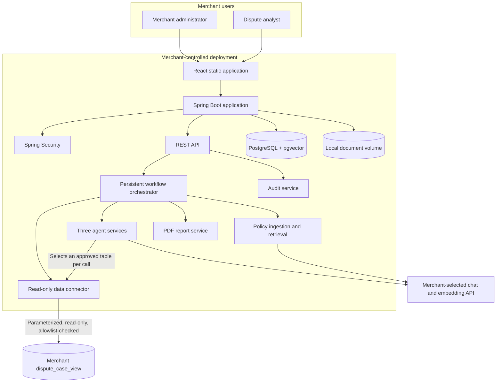
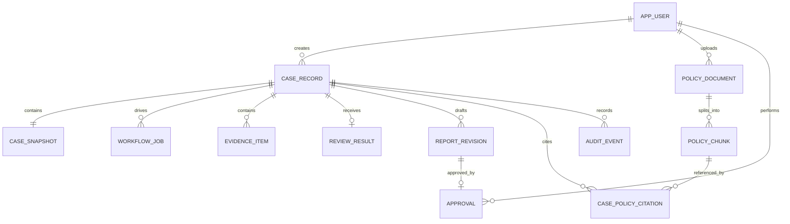
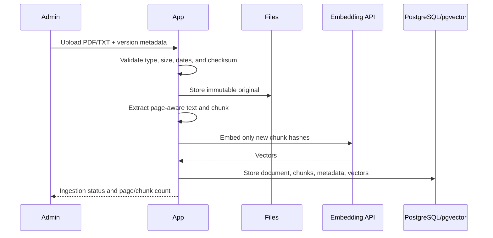

# Architecture and detailed design

## High-level design



## Container design

### `app`

- Spring Boot runtime.
- Compiled React assets served from Spring static resources.
- REST API and browser session handling.
- Workflow job executor.
- Spring AI model adapters.
- PDF and policy file processing.
- Filesystem adapter.

### `postgres`

- PostgreSQL application database.
- pgvector extension.
- Schema managed through Flyway.
- Separate named volume.

## Detailed component boundaries

| Component | Responsibility | Depends on |
|---|---|---|
| `AuthService` | Users, password hashing, sessions, roles | PostgreSQL, Spring Security |
| `SecretService` | Encrypt, mask, and retrieve local secrets | Installation key, PostgreSQL |
| `ConnectorService` | Execute an allowlist-checked, parameterized read of one admin-approved table for one order; reject anything else | Merchant DB, audit service |
| `SchemaDiscoveryService` | Introspect merchant schema metadata at setup and store the administrator-approved table/column allowlist | Merchant DB (metadata only), PostgreSQL |
| `CaseService` | Case lifecycle, ownership, snapshots, edits, approval | PostgreSQL, filesystem |
| `WorkflowService` | Durable states, job claiming, retry, idempotency, cost-ceiling enforcement | PostgreSQL |
| `EvidenceCollectorAgent` | Convert case facts into sourced evidence | Spring AI |
| `PolicyIngestionService` | Validate, extract, chunk, embed, and version policies | PDFBox, pgvector, filesystem |
| `PolicyRetrievalService` | Date/type filter (in the merchant time zone) and semantic retrieval | pgvector, embedding model |
| `EvidenceReviewerAgent` | Compare evidence with retrieved policy | Spring AI |
| `ReportGeneratorAgent` | Produce a structured draft with citations | Spring AI |
| `ReportService` | Validate approved content and render PDF | Filesystem, PostgreSQL |
| `AuditService` | Append-only security and business events | PostgreSQL |

## Package structure

```text
com.disputecopilot
├── auth
├── setup
├── connector
├── casework
├── workflow
├── agent
│   ├── collector
│   ├── reviewer
│   └── reporter
├── policy
│   ├── ingestion
│   └── retrieval
├── report
├── audit
├── storage
└── shared
```

Packages expose application-facing interfaces and keep persistence/model-provider details behind adapters. `ConnectorService` is defined behind a `MerchantConnector` interface with one implementation (`PostgresMerchantConnector`) in the MVP; a future MySQL implementation can be added without changing workflow or agent code, but is out of MVP scope (see [Product requirements](product-requirements.md)).

## Schema discovery and the bounded read tool

Merchant schemas are not known in advance, so the connector cannot ship with a hand-written query per customer. Discovery and execution are split into two phases that never overlap:

### Setup-time: discovery and approval (human in the loop, once)

1. `SchemaDiscoveryService` connects with the read-only connector identity and reads catalog metadata only — table and column names and types via `information_schema` — never row data.
2. It proposes a default allowlist: columns whose names match known patterns (order, payment, fulfillment, refund, communication fields) are pre-checked; anything it does not recognize, including anything that looks sensitive (`password`, `ssn`, `salary`, `internal`, `admin`, `token`), is left unchecked. When unsure, the default is always "not approved."
3. An administrator reviews the full table/column list — including everything the service left unchecked — and adjusts it. Nothing becomes readable without this explicit step.
4. The confirmed selection is stored as `table_allowlist_entry` rows (below), scoped to one connector profile. This step can be re-run later if the merchant's schema changes; it never runs automatically.

### Runtime: the bounded read tool (every case)

The Evidence Collector agent is given exactly one tool, `readApprovedTable(table, orderId)` — not a SQL execution tool, not a JDBC handle, and no way to supply query text:

- The tool rejects any `table` not present in `table_allowlist_entry` for the active connector profile. Only columns marked approved for that table are ever selected.
- Every call is scoped to the current order: the generated statement always includes the equivalent of `WHERE order_id = :orderId`, so a full-table read is not constructible through this tool.
- The application builds the SQL itself from the validated table/column identifiers and a bound parameter; the model never contributes SQL text, only the name of the table it wants to read next.
- Execution is read-only-transaction, row-limited, and time-limited, matching the constraints already described for the connector in [Security and privacy](security-and-privacy.md).
- Every call is written to `connector_query_audit` — table, columns, row count, case ID, timestamp — regardless of whether the model called it once or several times for one case.

This keeps the property that mattered from the original single-query design — the model cannot expand its own access, cannot see unapproved data, and cannot execute arbitrary SQL — while allowing the agent to read from whichever approved tables are actually relevant to a given order, across merchants with different schemas.

## Workflow state and recovery

Each case has one current state and an append-only transition history. A workflow job has:

- `case_id`
- `step`
- `status`
- `attempt_count`
- `available_at`
- `locked_by`
- `lock_expires_at`
- `idempotency_key`
- `last_error_code`

A scheduled worker atomically claims one eligible job. Successful output and the next job are committed in one database transaction. A process that dies after a claim releases the job through lock expiry. Agent calls use stable request IDs; validators prevent partial model output from advancing the workflow.

### Cost ceiling

Each case tracks cumulative estimated model token spend across all agent calls and repair attempts. When cumulative spend would exceed a configurable per-case ceiling (a deployment-level setting, not a prompt constant), the workflow does not make the call: it transitions the case to `MANUAL_REVIEW_REQUIRED` with `last_error_code = COST_CEILING_EXCEEDED` and writes an audit event. This is independent of, and checked before, the retry and repair-attempt limits in the error table below.

## Typed domain contracts

```text
CaseBundle
├── order
├── payment
├── fulfillment
├── refunds
├── communications
└── sourceSnapshot

EvidenceManifest
├── facts[] { kind, value, observedAt, sourceRef }
├── timeline[]
├── expectedEvidence[]
└── gaps[]

RetrievedPolicyContext
└── citations[] { documentId, title, version, page, chunkId, text, score }

ReviewResult
├── checks[]
├── contradictions[]
├── gaps[]
├── recommendation
├── confidence
└── caveats[]

DraftReport
├── caseSummary
├── timeline
├── responseNarrative
├── evidenceIndex
├── policyCitations
├── limitations
└── recommendation
```

## Grounding validation

Grounding is checked in two directions, not just one:

- **Policy claims → source text.** The validator confirms every citation's `quote` exists verbatim in the stored chunk it references before accepting model output (see [RAG and evaluation](rag-and-evaluation.md)).
- **Evidence facts → source data.** For every `EvidenceManifest` fact whose `kind` maps to a structured `CaseBundle` field (order, payment, fulfillment, or refund data), the validator re-reads that field from the case snapshot at `sourceRef` and rejects the fact if `value` does not match it exactly. A `sourceRef` that merely points at the right record is not sufficient; the value itself must agree. Narrative `timeline` entries that summarize rather than quote a field are exempt from exact-match, but must still carry a `sourceRef` that resolves to the current case.

This closes the gap where a fact could carry a valid-looking source reference while misstating what that source actually contains.

## Database model



Major tables:

- `app_user`, `user_role`, `user_session`
- `installation_config` (includes the merchant's IANA time zone used for policy effective-date calculations), `encrypted_secret`
- `connector_profile` (named plural by relational convention; a unique partial index enforces exactly one row per deployment for the MVP — this is a naming convention, not a hint of multi-profile support), `table_allowlist_entry` (one row per admin-approved table/column, scoped to a connector profile), `connector_query_audit`
- `case_record`, `case_snapshot`, `workflow_job`, `workflow_transition`
- `evidence_item`, `review_result`, `report_revision`, `approval`
- `policy_document`, `policy_chunk`, `case_policy_citation`
- `stored_file`, `audit_event`

## RAG sequence



At case review time, metadata filtering happens before semantic retrieval. The filters include active status, dispute type, `effective_from <= order_date`, and `effective_to IS NULL OR effective_to >= order_date`, where `order_date` is the order timestamp converted to a calendar date in the merchant's configured time zone (see [RAG and evaluation](rag-and-evaluation.md)).

## Report approval integrity

Approval records bind:

- Case ID.
- Report revision ID.
- SHA-256 of the canonical structured report — the `DraftReport` JSON with stable field ordering and UTF-8 encoding, **not** the rendered PDF bytes.
- Approving user and timestamp.
- Agent, prompt, model, and policy versions.

The PDF is deterministically regenerated from the approved structured report at download time; it is not itself the object of record. Integrity checks (including restore verification, see [Deployment runbook](deployment-runbook.md)) recompute the hash from the stored structured report and confirm the PDF regenerates without error — they do not byte-compare PDF files, since PDF rendering can embed non-deterministic elements such as generation timestamps.

Editing an approved report creates a new revision and invalidates the previous approval.

## Error categories

| Category | Example | Behavior |
|---|---|---|
| User input | Unknown order ID | Show actionable error; no retry |
| Connector transient | DB timeout | Bounded retry, then failed state |
| Connector policy violation | Agent requests a table not on the allowlist | Reject the call before execution; audit event; manual review |
| Model transient | Rate limit | Respect retry delay; bounded retry |
| Model validation | Missing citations | One constrained repair attempt, then manual review |
| Cost ceiling | Cumulative case spend would exceed the configured limit | Stop calling the model; manual review; audit event |
| Policy gap | No applicable policy | Manual review; no recommendation |
| Evidence gap | Missing delivery proof | Continue with explicit gap or manual review |
| Storage integrity | Checksum mismatch | Block file use and alert admin |
| Authorization | Analyst modifies policy | Return forbidden and audit event |

## Observability

- Structured JSON logs with correlation, case, workflow step, latency, model name, token usage, and error code.
- No raw secrets or unrestricted customer payloads in logs.
- Spring Boot Actuator liveness and readiness endpoints.
- Audit UI for business/security events.
- Metrics for queue depth, step latency, retries, manual review rate, cost-ceiling breaches, and model usage.
