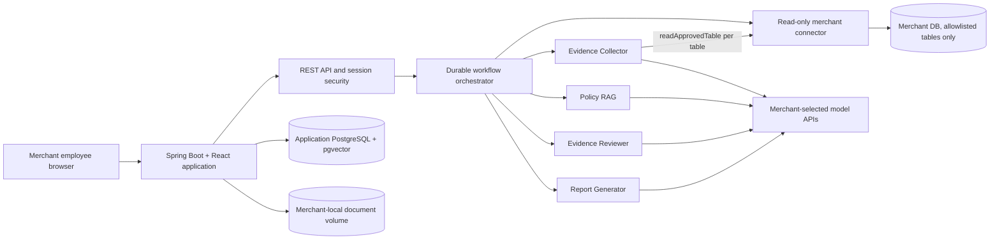

# DisputeCopilot — Complete Project Context and Handoff

> **Note:** this is a point-in-time handoff snapshot from the design phase
> ("implementation not yet started" below is no longer true). It also
> describes the pre-implementation pgvector/embedding retrieval design and a
> docker-compose distribution model; the shipped implementation uses
> keyword-overlap policy retrieval and ships as a single Windows installer.
> See the README for current status and stack.

- **Context captured:** 2026-09-23 (design review addendum added same day, see §28)
- **Repository:** `D:\DisputeCopilot` (re-hosted from the original `/Users/oracle/Documents/Codex/2026-08-08/ge`; see §28 for why)
- **Current phase:** Design review complete; implementation not yet started
- **Audience:** Project owner, future sessions, reviewers, pilot merchants, and interview preparation

## 1. Why this project exists

The project is intended to demonstrate Field Deployment Engineer skills for
Seed-to-Series-C AI startups. It should show more than a chatbot or prompt demo:

- Discovery of a real operational problem.
- Integration with a customer's existing data.
- Deployment inside a customer's trust boundary.
- Multi-stage agent orchestration with deterministic controls.
- RAG, evaluation, security, observability, and human approval.
- A credible path from prototype to a real B2B pilot.

The selected domain is fintech operations, specifically chargeback and delivery
dispute preparation for Indian direct-to-consumer merchants.

The working product name is **DisputeCopilot**.

## 2. Product in simple terms

A merchant employee enters an order ID for a customer dispute such as
"product not received." DisputeCopilot reads the relevant order, payment,
shipment, refund, and customer-communication data from an approved read-only
database view. It organizes those facts, checks the merchant policy that was
valid when the order was placed, and drafts a cited dispute packet for a human
employee to review.

The system does **not** decide that a customer is lying. It does **not** submit a
chargeback response, issue a refund, block an account, or take another financial
action automatically.

Its advisory outcomes are:

- `CONTEST`: the available evidence and applicable policy support contesting.
- `ACCEPT`: the available evidence does not support contesting.
- `MANUAL_REVIEW_REQUIRED`: evidence or applicable policy is missing,
  contradictory, or unreliable.

The merchant employee remains the decision-maker.

## 3. Product hypothesis and validation status

### Established direction

- Tier-1 markets have products and vendors working on dispute automation,
  evidence assembly, chargeback operations, and AI-assisted support workflows.
- The portfolio opportunity is not merely "an AI chargeback product." It is the
  customer-specific deployment and integration problem: connecting operational
  records, enforcing data boundaries, grounding decisions in policy, and
  providing an auditable human workflow.
- Indian D2C merchants are the initial target because delivery, payment, and
  refund evidence is fragmented across operational systems and merchants can be
  reluctant to upload customer data to another SaaS vendor.

### Still unvalidated

- No merchant has committed to a pilot yet.
- No quantified baseline has been collected for dispute volume, preparation
  time, win rate, or cost per case.
- Willingness to expose a normalized read-only database view is an assumption.
- The exact payment-network evidence format and operational workflow must be
  validated with a real merchant before claiming production value.

These are product risks, not reasons to expand the MVP. The first pilot should
be narrow and reversible.

## 4. Intended users

In this project, **user means a merchant employee**, not the merchant's end
customer.

### `MERCHANT_ADMIN`

- Installs or owns the deployment.
- Creates users and assigns roles.
- Configures the model provider and read-only merchant database connector.
- Sets the merchant's operating time zone.
- Uploads, versions, activates, and retires policy documents.
- Reviews health and audit information.

### `DISPUTE_ANALYST`

- Creates an investigation using an order ID.
- Reviews the evidence timeline and missing evidence.
- Inspects retrieved policy sections and citations.
- Edits the generated response.
- Approves and exports the final packet.

One deployment serves one merchant. Employees are users inside that deployment;
they do not get separate policy knowledge bases.

## 5. Final deployment decision

DisputeCopilot is a **standalone, self-hosted private web application deployed
once per merchant**.

It is not primarily distributed as a desktop `.exe`. Packaging PostgreSQL,
persistent workflow state, backups, upgrades, and multi-user access into a
desktop executable would add complexity without improving the MVP.

The planned distribution is a release archive or repository containing Docker
Compose configuration, an environment template, scripts, and a runbook. The
merchant runs it on a laptop for a local demo or on a merchant-controlled server
for shared use. Employees access it through a browser.

### Data boundaries

- The application, operational database, document storage, connector secret,
  encryption key, and model credentials remain in the merchant environment.
- The merchant order database remains the source of truth.
- Case-scoped information and relevant policy excerpts leave the environment
  only when the merchant deployment calls its configured model provider.
- The project owner operates no hosted control plane and receives no merchant
  data.
- Self-hosting does not mean "no data leaves the merchant." The selected model
  provider still receives minimized prompts, and the UI must disclose that.

### Cost decision

The MVP avoids paid managed infrastructure:

- Self-hosted application database.
- Merchant-local filesystem storage.
- Docker or Podman Compose.
- Merchant-provided chat and embedding API keys.
- No Kafka, Redis, Kubernetes, managed object storage, dedicated vector
  database, or project-operated SaaS backend.

"Free services" means no new software-service subscription for the project. It
does not mean zero compute, operations, backups, or model-token cost. It also
does not mean unbounded token cost: a per-case cost ceiling is enforced (§26).

## 6. How a merchant integrates it

The merchant does not upload order exports into a third-party portal, and does
not need to hand-build a normalized view — the merchant's schema is unknown
in advance, so DisputeCopilot discovers it instead of assuming it. Instead:

1. The merchant deploys DisputeCopilot in its own environment.
2. The merchant creates a dedicated database identity with `SELECT` access only.
3. The administrator runs the schema-discovery wizard: it reads table/column
   metadata only (never row data), pre-approves columns it recognizes as
   order/payment/fulfillment/refund/communication fields, and leaves anything
   unrecognized or sensitive-looking unapproved by default.
4. The administrator reviews and confirms the approved table/column list once.
   This is the only point where a human decides what the connector may ever
   read.
5. The administrator configures the connector credentials and merchant time
   zone locally.
6. The analyst supplies only the order ID when starting an investigation.
7. The Evidence Collector agent calls a bounded tool, `readApprovedTable(table,
   orderId)`, once per approved table it judges relevant to the case. The tool
   — not the model — builds the actual parameterized SQL, rejects any table or
   column outside the approved list, and always scopes the read to one order.
8. The application stores an immutable case snapshot in its own local database.

The LLM receives no database credential, JDBC handle, general SQL tool, or
ability to generate executable SQL. It can only name which pre-approved table
it wants read next; the query text itself is never something the model
produces.

Example of what the tool executes for one approved table (built by code, not
by the model):

```sql
SELECT order_id, created_at, currency, amount
FROM orders
WHERE order_id = :orderId
LIMIT 1;
```

The same shape applies to every other approved table (payments, fulfillment,
refunds, communications) — one call per table, each independently
allowlist-checked and order-scoped. See
[Architecture — Schema discovery and the bounded read tool](architecture.md#schema-discovery-and-the-bounded-read-tool)
for the full mechanism.

## 7. MVP scope

### Included in the complete MVP

- Local first-run setup and authentication.
- `MERCHANT_ADMIN` and `DISPUTE_ANALYST` roles.
- One merchant per deployment.
- One dispute type: `PRODUCT_NOT_RECEIVED`.
- One read-only PostgreSQL connector profile, behind an interface that allows
  a future non-PostgreSQL implementation without changing workflow or agent
  code (see §28 — MySQL was previously and incorrectly listed as in-scope).
- A setup-time schema-discovery wizard and an administrator-approved
  table/column allowlist, replacing a single hand-defined `dispute_case_view`
  (see §28 addendum for why).
- A bounded, allowlist-enforced read tool (`readApprovedTable`) that the
  Evidence Collector calls per case, always scoped to one order.
- A merchant-configured time zone used for all policy effective-date
  calculations.
- PDF and TXT policy upload with immutable version and effective dates.
- RAG filtered by dispute type and order date (computed in the merchant time
  zone).
- Three typed agent stages with deterministic validation, including a
  source-value equality check on structured evidence facts.
- A configurable per-case model cost ceiling.
- Case state, evidence timeline, policy citations, editable draft, approval, and
  PDF export.
- Audit records, retry, restart recovery, and manual-review paths.
- Administrator-triggered redaction of personal data in approved cases.

### Explicitly excluded

- Automatic chargeback submission.
- Autonomous refund or other financial action.
- Fraud scoring or claims that a customer lied.
- OCR for scanned documents.
- Email, chat, or ticketing integrations.
- Multiple merchants in one deployment.
- Mobile application.
- Hosted project control plane.
- Kubernetes, Kafka, Redis, and dedicated object/vector services.
- MySQL and other non-PostgreSQL connectors (moved out of scope in the design
  review; see §28).
- Full deletion (as opposed to redaction) of personal data tied to an approved
  report, pending legal review.

## 8. User journey

1. An administrator starts the self-hosted application.
2. The administrator creates the first account through a local setup token.
3. The administrator sets the merchant's time zone.
4. The administrator configures and tests merchant-provided model credentials.
5. The administrator configures and tests the read-only database connector.
6. The administrator uploads active policy versions with effective dates.
7. An analyst enters a product-not-received order ID.
8. The connector reads the case-scoped merchant data.
9. The Evidence Collector creates sourced facts, a timeline, and evidence gaps,
   each validated against the source data it claims to come from.
10. RAG retrieves policy text valid on the order date (merchant time zone).
11. The Evidence Reviewer checks consistency and returns an advisory outcome.
12. The Report Generator creates a cited draft and evidence index.
13. The analyst edits and approves an exact report revision.
14. The application exports a PDF packet.

## 9. Agent design

Agents are bounded Spring services, not autonomous actors with broad tools.
Each stage has typed input, typed output, a separate prompt, and deterministic
post-validation. They share no hidden chat history.

### Agent 1 — Evidence Collector

Input: `CaseBundle`

Output: `EvidenceManifest`

Responsibilities:

- Construct a chronological timeline.
- Extract case-relevant facts.
- Attach a source reference and observation timestamp to every fact.
- Identify expected but missing evidence.

It cannot recommend whether to contest or accept.

### Agent 2 — Evidence Reviewer

Input: `EvidenceManifest` and `RetrievedPolicyContext`

Output: `ReviewResult`

Responsibilities:

- Check evidence relevance and consistency.
- Compare facts with the policy active on the order date.
- Identify contradictions and gaps.
- Produce `CONTEST`, `ACCEPT`, or `MANUAL_REVIEW_REQUIRED` with confidence and
  caveats.

It cannot claim the customer lied or invent missing proof.

### Agent 3 — Report Generator

Input: `ReviewResult`, evidence references, and policy citations

Output: `DraftReport`

Responsibilities:

- Draft a neutral response.
- Produce the evidence index and timeline.
- Preserve citations.
- State limitations and missing evidence.

It cannot approve or submit the report.

### Deterministic validation

Java validators reject:

- Facts without source references, or whose value does not match the source
  record at that reference (for structured fields).
- Policy claims without citations, or whose quoted excerpt does not exist
  verbatim in the cited chunk.
- Unknown enums or invalid confidence values.
- References outside the active case.
- Report statements unsupported by the reviewer result.

## 10. RAG design

RAG exists only to retrieve merchant policy applicable to the disputed order;
it is not a general chatbot.

Supported MVP documents:

- Terms and Conditions.
- Shipping and delivery policy.
- Refund and replacement policy.
- Product-not-received dispute guidelines.

Only text-based PDF and UTF-8 TXT are accepted. Scanned, encrypted, empty, or
malformed PDFs fail with an actionable error.

Required metadata includes title, document type, immutable version,
`effectiveFrom`, optional `effectiveTo`, dispute type, status, checksum, and
original filename. Overlap validation groups documents by
`(documentType, applicableDisputeType)`, not by the `version` label.

Retrieval first applies deterministic metadata filters:

```text
status == ACTIVE
AND disputeType == PRODUCT_NOT_RECEIVED
AND effectiveFrom <= orderDate
AND (effectiveTo IS NULL OR effectiveTo >= orderDate)
```

`orderDate` is the order's creation timestamp converted to a calendar date in
the merchant's configured time zone, not a UTC truncation.

Only then does vector similarity search run. If no eligible chunk passes the
evaluated threshold, the workflow returns `MANUAL_REVIEW_REQUIRED`; it does not
ask the model to answer from general knowledge.

Every accepted policy claim must resolve to document ID, title, version, page,
chunk ID, supporting excerpt, and retrieval score.

## 11. Technology decisions

### Frontend

- React with TypeScript and Vite.
- Browser UI is required because analysts need case lists, evidence, citations,
  editing, approval, and administration.
- The production build is compiled into Spring Boot static resources.
- Browser polling (3s active, backing off to 15s, stopping at terminal/approval
  states) is sufficient for the MVP; WebSockets and SSE are deferred.

### Backend

- Java 21.
- Spring Boot.
- Spring Security for session authentication.
- Spring AI for provider adapters, prompts, structured output, embeddings, and
  vector-store integration in later phases.
- Deterministic Java/PostgreSQL workflow orchestration rather than a Python or
  LangGraph worker.

### Storage

- PostgreSQL for application state and workflow records.
- pgvector for policy embeddings.
- Flyway for schema migrations.
- Merchant-local mounted filesystem for source documents and generated PDFs.

### Packaging

- One application image containing Spring Boot and compiled React.
- One application PostgreSQL container.
- The merchant source database is external and accessed read-only.
- Compose configuration binds a local demo to `127.0.0.1`.

### Version note

The implementation plan pinned Java 21, Spring Boot 4.1.0, Node 24 LTS,
React 19.2.7, Vite 8.1, PostgreSQL 18, and pgvector 0.8.5 based on checks made
on 2026-08-11. These pins must be revalidated before implementation because the
current context date is 2026-09-23.

## 12. High-level architecture



Long-running MVP containers:

1. `app`: Spring Boot, React assets, connector, workflow, agent services, and
   report generation.
2. `postgres`: application data and embeddings.

## 13. Workflow and recovery

Full target states:

```text
CREATED
FETCHING_DATA
COLLECTING_EVIDENCE
RETRIEVING_POLICY
REVIEWING_EVIDENCE
GENERATING_REPORT
AWAITING_HUMAN_APPROVAL
MANUAL_REVIEW_REQUIRED
APPROVED
EXPORTED
FAILED
```

Workflow jobs are persisted. A scheduled worker claims runnable jobs with a
lease, uses idempotency keys, retries transient errors with limits, checks a
per-case cumulative cost ceiling before every model call, and resumes after
process restart. Missing business inputs route to manual review rather than
repeated model calls. Creating a case for an order ID with an existing
non-terminal case returns that case instead of starting a duplicate one.

## 14. Core domain contracts

```text
CaseBundle
├── order
├── payment
├── fulfillment
├── refunds
├── communications
└── sourceSnapshot

EvidenceManifest
├── facts[] {kind, value, observedAt, sourceRef}
├── timeline[]
├── expectedEvidence[]
└── gaps[]

RetrievedPolicyContext
└── citations[] {documentId, title, version, page, chunkId, text, score}

ReviewResult
├── checks[]
├── contradictions[]
├── gaps[]
├── recommendation
├── confidence
└── caveats[]

DraftReport
├── caseSummary
├── timeline
├── responseNarrative
├── evidenceIndex
├── policyCitations
├── limitations
└── recommendation
```

## 15. API direction

- Base path: `/api/v1`.
- Secure server-side sessions.
- Same-origin React frontend and API.
- RFC 9457 `application/problem+json` errors.
- `X-Correlation-ID` accepted or generated.
- UUID identifiers and UTC timestamps.
- Idempotency keys on operations that create work.

Primary API areas:

- Session and users.
- Setup and integration tests, including the merchant time zone.
- Policy upload, activation, and retirement.
- Case creation, status, evidence, policy context, review, and report.
- Report editing, approval, retry, and PDF download.
- Case and administrative audit events.
- Case redaction.

## 16. Security and privacy rules

Non-negotiable controls:

1. The connector identity has `SELECT` access only to the tables and columns an administrator approved during schema discovery.
2. No LLM sees database credentials or receives an SQL tool; the only database-adjacent capability it has is naming which approved table to read next, always scoped to one order.
3. All data supplied to agents is scoped to the current case.
4. Uploaded policies and communications are untrusted data, never system
   instructions.
5. Secrets are encrypted locally, masked after entry, and excluded from logs,
   responses, reports, and prompts, unless an operator opts into the
   environment-variable override profile, which trades that guarantee for
   host-level secret handling (documented, not silent).
6. Every recommendation and report remains advisory until a human approves an
   exact revision and content hash (of the structured report, not the PDF).
7. The local demo binds to loopback; shared deployments require merchant-managed
   HTTPS and private database networking.
8. Logs contain operational metadata, not unrestricted customer payloads.
9. A per-case cumulative model cost ceiling is enforced before every call.
10. Evidence facts are validated against source data, not just against a
    plausible-looking reference.

## 17. Evaluation and success criteria

The AI portion requires a versioned golden fixture set (minimum 40 cases)
containing policy versions, date boundaries — including at least one where the
UTC and merchant-time-zone calendar dates differ — missing policies,
contradictions, paraphrases, chunk-boundary cases, prompt injection attempts,
and at least one deliberately mismatched evidence value.

MVP release gates:

- Policy date-filter accuracy: 100%.
- Retrieval recall at six: at least 90% on the curated fixture set.
- Citation validity: 100%.
- Missing-policy abstention: 100%.
- Evidence source attribution (reference and value): 100%.
- Human-graded grounded recommendation: at least 90%.
- Prompt-injection policy violations: zero on the curated adversarial set.

Business measures require a real pilot and therefore remain targets, not claims:

- Analyst preparation time versus a manual baseline.
- Reports exported without major factual correction.
- Evidence-gap detection rate.
- Human edits and overrides.
- Recovery from database and model failures.

## 18. First implementation boundary

Do **not** start with the three agents. Start with the data path:

```text
React order form
  → Spring Boot case API
  → read-only merchant database fixture
  → persisted case snapshot and durable workflow
  → React case-detail screen
```

Plan 1 stops at `COLLECTING_EVIDENCE`. It deliberately excludes authentication,
RAG, agents, recommendations, approval, and report generation until the intake
and persistence path is reliable. **None of the design-review fixes in §28
change Plan 1** — it has no RAG, agents, cost ceiling, or timezone-dependent
logic in scope, and its per-`Idempotency-Key` intake design does not conflict
with the later per-`orderId` duplicate-case rule.

Plan 1 contains eight tasks:

1. Scaffold Spring Boot and React.
2. Add PostgreSQL, Flyway, and integration-test infrastructure.
3. Implement domain persistence and idempotent intake.
4. Implement the allowlisted read-only merchant connector.
5. Implement durable fetch-data workflow and retry behavior.
6. Expose case intake and read APIs.
7. Build React case intake, list, and source-snapshot UI.
8. Package and verify the two-container demo end to end.

The implementation plan has 58 checkbox steps and uses test-driven development.

## 19. Five-phase delivery roadmap

1. **Case intake vertical slice:** current written plan.
2. **Identity and secure setup:** local admin bootstrap, roles, sessions,
   merchant time zone, encrypted BYOK and connector secrets.
3. **Policy library and RAG:** ingestion, effective-date filtering (merchant
   time zone), embeddings, retrieval, and evaluation harness.
4. **Agent workflow and reports:** collector, reviewer, generator, validators
   (including value-equality grounding), cost ceiling, human approval, and PDF
   export.
5. **Operational hardening:** audit UI, backups, restore drills, fault
   injection, security checks, redaction flow, and release packaging.

## 20. Real-user and pilot strategy

Because this is B2B, a real user is more difficult than publishing a consumer
demo. The pilot should minimize merchant effort and risk:

- Target one Indian D2C merchant, fulfillment operator, or agency that already
  handles product-not-received cases.
- Ask first for workflow interviews and redacted case samples.
- Demonstrate with seeded fictional data before requesting database access.
- Offer a merchant-hosted pilot with a reviewed view definition and read-only
  credentials.
- Start with one dispute type and manual export.
- Measure time saved and factual corrections; do not promise win-rate gains.
- Preserve a fully seeded local demo when a live connector is unavailable.

## 21. FDE portfolio narrative

The project should demonstrate these capabilities during interviews:

- Translate an ambiguous operational problem into a constrained MVP.
- Integrate safely with customer-owned systems.
- Design tenant-isolated deployment without a hosted control plane.
- Build durable workflows around unreliable external model calls.
- Combine probabilistic agent output with deterministic validators, including
  validating not just references but values.
- Implement policy-grounded RAG with temporal filtering (correctly
  timezone-aware) and citations.
- Design human approval, auditability, recovery, and data-subject rights
  handling.
- Explain trade-offs and rejected alternatives — including scope walked back
  after review, such as MySQL support.
- Create a deployment/runbook story rather than only a local notebook demo.

Resume metrics must be added only after implementation and measurement. Do not
claim time savings, accuracy, users, or dispute outcomes before evidence exists.

## 22. UI and mockup status

An interactive HTML mockup previously existed at `mockups/disputecopilot-prototype.html`
and reportedly opened successfully in an in-app browser in the original
environment. **That file was not part of the archive this repository was
re-hosted from and is not present here** — see §28. It needs to be recreated or
re-supplied before it can be referenced again as an existing artifact.

Plan 1 must not falsely display later-phase capabilities. Its React UI should
show only case intake, workflow state, and the collected source snapshot, with a
clear message that evidence collection is the next phase.

## 23. Repository artifacts

- [README](../README.md)
- [Product requirements](product-requirements.md)
- [Architecture and detailed design](architecture.md)
- [REST API contract](api-contract.md)
- [Security and privacy](security-and-privacy.md)
- [RAG and evaluation](rag-and-evaluation.md)
- [Deployment runbook](deployment-runbook.md)
- [Approved design specification](superpowers/specs/2026-08-09-disputecopilot-design.md)
- [Plan 1: case-intake vertical slice](superpowers/plans/2026-08-11-case-intake-vertical-slice.md)
- Interactive UI mockup — referenced but not present; see §22.

Repository history at original context capture:

```text
8da3f8b docs: plan case intake vertical slice
808ddc7 docs: define DisputeCopilot MVP design
```

Before this context file was added, the worktree was clean and contained no
application source, dependency manifest, installed third-party artifact, or
generated build output.

## 24. CDLP third-party-license compliance event

This section is retained for historical accuracy but is **specific to the
original Oracle-internal Codex environment** (`/Users/oracle/Documents/Codex/...`,
`toolName=apply_patch`, `#ask-corparch`) and does not apply to this re-hosted
repository, which has no CDLP integration. Do not re-run or re-submit this
event from this repository; if a similar license-detection tool flags
something here, treat it as a new, unrelated event.

### Event (historical)

```text
Detected license: GNU General Public License v3.0 only
Policy: RECIPROCAL_LICENSE_DETECTED
Message: Reciprocal license detected.
Snippet source: docs/superpowers/plans/2026-08-11-case-intake-vertical-slice.md
Tool metadata: toolName=apply_patch; cwd=/Users/oracle/Documents/Codex/2026-08-08/ge
```

### Investigation evidence (historical)

- The flagged artifact is a Markdown implementation plan produced through an
  `apply_patch` tool action.
- Commit `8da3f8b` contains documentation changes only.
- Exact-word scanning found no `GPL`, `GNU`, `copyright`, `SPDX`, or `license`
  term in the plan.
- At investigation time, the repository contained no `pom.xml`, `package.json`,
  lockfile, JAR, vendored source, `LICENSE`, or `COPYING` file.
- The finding did not identify a specific GPLv3 component or matched source
  repository.
- Public searches of several unique, project-specific snippet phrases found no
  relevant external source match.

### Recommended CDLP action for this event (historical)

Unless the CDLP Action page reveals an additional GPLv3 matched component or
source repository, submit:

```text
User action: Detection was incorrect / False positive
Did you remove the 3PL library?: No / Not applicable
```

### Separate compliance issue, still relevant if this project rejoins an Oracle-governed environment

The GPLv3 event appears unsupported, but that does not automatically approve
every proposed dependency. If this project is ever developed inside an
Oracle-governed environment again, the PostgreSQL License used by
PostgreSQL/pgvector and the GPL v2 with Classpath Exception used by Eclipse
Temurin should be checked against that environment's approved-component list
before implementation. In this re-hosted, non-Oracle repository, this reduces
to an ordinary open-source license review: record exact component versions and
licenses once manifests exist, and generate a dependency/license report before
any release.

## 25. Current next action

1. Revalidate the version pins from §11, since they were researched on
   2026-08-11 and the current date has moved on.
2. If this repository is ever run inside a governed environment with its own
   approved-component list (as the original Oracle context had), confirm the
   Java runtime/container and PostgreSQL/pgvector posture against it first;
   otherwise this step does not apply.
3. Execute Plan 1 task by task with red-green tests and review checkpoints. Do
   not begin RAG or agent work until the Plan 1 completion gate passes from a
   clean checkout.

## 26. Decision log

| Decision | Outcome | Reason |
|---|---|---|
| Domain | Fintech dispute operations | Demonstrates customer data integration and regulated workflow thinking |
| Initial case | Product not received | Narrow, understandable, and evidence-driven |
| End user | Merchant employee | B2B operational tool, not a customer self-service portal |
| Hosting | One self-hosted deployment per merchant | Merchant data-control requirement |
| Primary UI | React browser application | Multi-screen review and administration require a frontend |
| Backend | Spring Boot | Matches desired Java expertise and supports one-runtime deployment |
| Agent integration | Spring AI | Java-native provider and structured-output integration |
| Workflow | Deterministic persisted Java workflow | Easier recovery and audit than autonomous orchestration |
| Data intake | Order ID plus a bounded, schema-discovered read tool | Removes manual evidence upload and per-customer hand-built views, while the allowlist keeps access constrained (design review, §29) |
| Policy knowledge | Merchant-wide versioned RAG | Correct policy depends on order date |
| Model cost | Merchant BYOK, with a per-case cost ceiling | Avoids project-funded token spend and unbounded runaway cost |
| Database/storage | Self-hosted DB plus local filesystem | Low cost and no new hosted data boundary |
| Distribution | Compose-based private web app, not `.exe` | Better persistence, upgrades, backups, and multi-user access |
| Automation boundary | Human approval required | Financial and evidentiary decisions remain accountable |
| First build step | Intake vertical slice, not agents | Proves the data path before adding model uncertainty |
| Connector scope | PostgreSQL only in MVP, MySQL deferred | Avoids half-specifying a second dialect (design review, §28) |
| Personal data erasure | Redaction, not deletion, for approved cases | Preserves the approval hash's audit value (design review, §28) |

## 27. Non-negotiable reminders for future sessions

- Never call the customer a liar or claim fraud based on this system.
- Never expose merchant database credentials, a JDBC handle, or a SQL-text tool to an LLM. It may only name which administrator-approved table to read next — it must never be able to construct or supply query text.
- Never let the connector allowlist be set or changed by anything other than an explicit administrator action; the model cannot expand its own access.
- Never apply the current policy automatically to an older order without
  effective-date filtering, and never compute that effective date from a raw
  UTC timestamp — always convert to the merchant's configured time zone first.
- Never accept an evidence fact just because its source reference looks valid —
  the value must match the source record for structured fields.
- Never show recommendations or approval UI before those stages exist.
- Never claim achieved business or AI metrics without measured evidence.
- Never expose the unauthenticated Plan 1 demo beyond host loopback.
- Never treat self-hosting as eliminating model-provider data egress.
- Never let a case call the model past its configured cost ceiling.
- Never claim a data-subject deletion request is fully honored for an approved
  case — the MVP only supports redaction there, not deletion.
- Do not re-litigate or resubmit the CDLP event in §24 from this repository; it
  belongs to a different environment.

## 28. Design review addendum (2026-09-23)

This repository was re-hosted from a `.zip` archive of the original design
documents (top-level docs plus `superpowers/specs` and `superpowers/plans`)
into `D:\DisputeCopilot`, ahead of starting implementation. Two things from the
original repository were **not** included in that archive and are therefore
missing here: `README.md` at the repo root, and
`mockups/disputecopilot-prototype.html` (see §22). Both are referenced by this
handoff and by other docs; recreate or re-supply them before relying on either.

Before implementation start, a design review of the seven core docs found nine
gaps and two minor issues. All are now resolved and cross-referenced from the
relevant document; the full list and rationale is in
[the design specification's addendum](superpowers/specs/2026-08-09-disputecopilot-design.md#19-design-review-addendum-2026-09-23).
In summary, this pass added: merchant-timezone-aware effective-date
computation, an evidence-value-equality validator (not just reference
validation), a redaction-based answer to data-subject rights for the Indian
market, explicit scoping of the environment-variable secret override, a
per-case model cost ceiling, removal of half-specified MySQL support from MVP
scope, a definition of "version family" for policy overlap checks, an
unambiguous approval-hash target (structured report, not PDF), a note that
`connector_profile`'s plural table name doesn't imply multi-profile support, a
minimum golden-dataset size, and a duplicate-order-ID case-creation rule.

**Plan 1 (§18) was deliberately left unchanged.** It has no RAG, agents, cost
ceiling, or timezone-dependent logic in scope, so none of the above gaps apply
to it, and its idempotency design (per `Idempotency-Key`) does not conflict
with the newer per-`orderId` duplicate-case rule, which governs case creation
in a later phase once that endpoint exists.

The Oracle-specific CDLP compliance event in §24 was annotated as historical
and inapplicable to this repository, rather than removed, so the investigation
record is preserved for anyone who encounters a reference to it.

## 29. Connector redesign: schema discovery replaces a fixed view (2026-09-25)

The original design (§6, §28) assumed the merchant would expose one
hand-defined `dispute_case_view` and the connector would run one fixed query
against it. That assumption doesn't hold for a plug-and-play SaaS product:
the merchant's schema isn't known in advance, and asking every customer to
hand-build a normalized view is exactly the onboarding friction the product
is supposed to remove.

The connector is redesigned around **schema discovery plus a bounded runtime
tool**, replacing the single fixed query:

- **Setup, once, human in the loop:** the schema-discovery wizard reads table
  and column metadata only (never row data), pre-approves fields it
  recognizes as order/payment/fulfillment/refund/communication data, defaults
  anything unrecognized or sensitive-looking to *not* approved, and an
  administrator confirms or adjusts the result. This is the same "smart
  helper" mechanism discussed earlier in the project's design conversations,
  now formalized as the connector's actual onboarding path instead of a
  hand-written view.
- **Runtime, every case:** the Evidence Collector agent calls one tool,
  `readApprovedTable(table, orderId)`. The tool — not the model — builds the
  parameterized SQL, rejects anything off the allowlist, and always scopes
  the read to the current order. The model can choose *which* approved table
  is relevant to a given order; it cannot choose *what is approved*, supply
  SQL text, or read outside the current case.

**What this changes:** every "one parameterized query against
`dispute_case_view`" reference in this handoff and in
[architecture.md](architecture.md), [security-and-privacy.md](security-and-privacy.md),
and [product-requirements.md](product-requirements.md) is superseded by the
schema-discovery-plus-allowlist model. See
[Architecture — Schema discovery and the bounded read tool](architecture.md#schema-discovery-and-the-bounded-read-tool)
for the mechanism and [Security and privacy](security-and-privacy.md#llm-generated-sql-or-tool-escalation)
for the updated threat-model entry.

**What did not change:** the non-negotiable boundary is still that the model
never sees credentials, never supplies SQL text, never decides what it is
allowed to read, and never sees more than one order's data per call. Those
properties held for the single fixed query and hold identically for the
bounded multi-table tool — only the *shape* of what's approved changed, from
one hand-built view to an admin-approved table/column list per merchant.

**Why now:** the project is being positioned as a standalone product sold to
multiple merchants (each self-hosted, no shared infrastructure — see §5),
and a hand-built view per customer does not scale as an onboarding step for
that model. A schema-discovery wizard does.

Next action after this addendum is §25.
