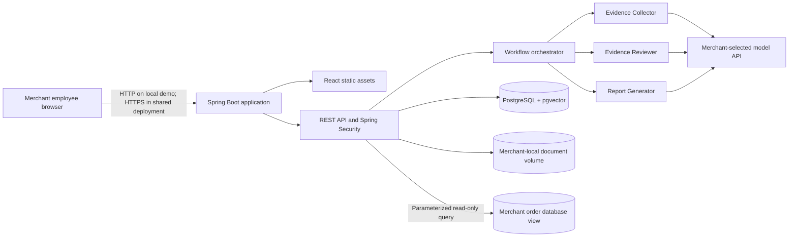
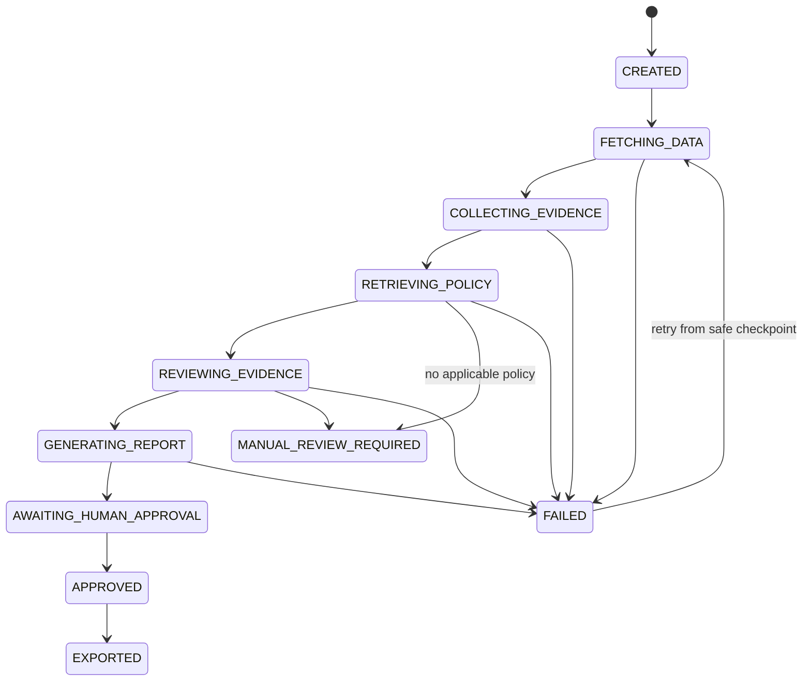

# DisputeCopilot design specification

- **Status:** Approved for documentation; implementation requires final document review
- **Date:** 2026-08-09 (addendum 2026-09-23 — see §19)
- **Target:** Portfolio-grade FDE project for Seed-to-Series-C AI companies
**Domain:** Fintech operations / chargeback evidence preparation

## 1. Decision summary

Build a browser-based, self-hosted application deployed once per merchant. The frontend is a React + Vite SPA compiled into Spring Boot static resources. Spring Boot owns the API, authentication, connector, workflow, agents, RAG, report generation, and audit trail. PostgreSQL with pgvector stores operational records and embeddings. Source PDFs and generated reports remain in a merchant-local mounted filesystem.

The merchant supplies model and embedding API credentials. External model calls therefore go directly from the merchant deployment to the selected provider; no project-operated control plane receives merchant data.

## 2. Problem and boundary

The MVP prepares evidence for one chargeback reason: **product not received**. It does not decide whether a customer is truthful, does not make a legally binding determination, and does not submit or execute financial actions.

The system may recommend one of:

- `CONTEST` — available evidence and applicable policy support contesting the dispute.
- `ACCEPT` — available evidence does not support contesting the dispute.
- `MANUAL_REVIEW_REQUIRED` — required evidence or applicable policy is missing, contradictory, or unreliable.

Every recommendation is advisory and requires human approval.

## 3. Users and roles

### `MERCHANT_ADMIN`

Configures local secrets, connector settings, users, policies, and the merchant time zone. Can view cases and audit events.

### `DISPUTE_ANALYST`

Creates investigations, reviews evidence and citations, edits drafts, approves reports, and exports PDFs. Cannot change connector or policy configuration.

One deployment serves one merchant. Individual employees are users within that deployment; they do not receive separate RAG knowledge bases.

## 4. Deployment architecture



The distributed release contains two long-running containers:

1. `app`: Spring Boot, compiled React assets, workflow executor, and report generation.
2. `postgres`: PostgreSQL with pgvector.

Named volumes persist PostgreSQL data and application documents. Redis, Kafka, Kubernetes, Nginx, a separate agent worker, and dedicated object/vector services are excluded from the MVP.

## 5. Trust and data boundaries

### Merchant environment

Contains the application, application database, document volume, encryption key, connector credentials, and model credentials.

### Merchant source database

Remains the source of truth for orders, payments, fulfillment, refunds, and communications. The application reads only a documented view through a least-privilege service account.

### Model provider

Receives only case-scoped facts and retrieved policy excerpts required for a particular agent stage. The UI discloses this egress and identifies the configured provider. Credentials travel directly from the merchant deployment to that provider.

## 6. Merchant database integration

The merchant's schema is not known in advance, so the connector does not assume a hand-built view. Instead, integration happens in two phases (see [Architecture — Schema discovery and the bounded read tool](../../architecture.md#schema-discovery-and-the-bounded-read-tool) for the full mechanism):

**Setup, once:** a schema-discovery wizard reads table/column metadata only (never row data), pre-approves fields it recognizes as order/payment/fulfillment/refund/communication data, and defaults anything unrecognized or sensitive-looking to not approved. An administrator reviews and confirms the allowlist.

**Runtime, per case:** the LLM has no database credentials, JDBC handle, or general SQL tool. The Evidence Collector calls one bounded tool, `readApprovedTable(table, orderId)`, once per approved table it judges relevant. The tool — not the model — builds the parameterized SQL, rejects anything off the allowlist, and always scopes the read to one order:

```sql
-- one of several calls the tool may make for a single case,
-- each independently allowlist-checked
SELECT order_id, created_at, currency, amount
FROM orders
WHERE order_id = :orderId
LIMIT 1;
```

Tables merchants typically approve cover:

- Order identifier, creation time, currency, and amounts.
- Payment identifier, status, processor reference, and timestamps.
- Fulfillment and shipment identifiers, carrier, tracking events, and delivery proof references.
- Refund or replacement records.
- Case-relevant customer communications.

The connector assembles the results of these calls into a `CaseBundle`. It records, per call, the table, columns, timestamp, duration, and row count without logging secrets or unrelated customer data.

The connector is defined behind a `MerchantConnector` interface with a single PostgreSQL implementation in the MVP. A MySQL implementation is a possible future addition, not MVP scope (see [Product requirements](../../product-requirements.md)).

## 7. Workflow



The orchestrator is deterministic Spring code backed by PostgreSQL. Each transition uses an idempotency key and optimistic locking. A scheduled executor claims runnable workflow jobs from a database table, so process restarts do not lose investigations.

Transient connector/model errors receive bounded exponential-backoff retries. Validation errors and missing business inputs route to manual review rather than repeated model calls. A per-case cumulative cost ceiling is checked before every model call, independent of the retry limit; exceeding it also routes to manual review (see [Architecture — Cost ceiling](../../architecture.md#cost-ceiling)).

Creating a case for an order ID that already has a non-terminal case returns that existing case rather than starting a second concurrent investigation (see [API contract](../../api-contract.md)).

## 8. Agent contracts

Agents are bounded Spring services with individual prompts, typed inputs, typed outputs, and no shared hidden conversation.

### Evidence Collector

Input: `CaseBundle`

Output: `EvidenceManifest`

Responsibilities:

- Build a chronological timeline.
- Extract case-relevant facts.
- Attach a `sourceRef` to every fact.
- Identify missing expected evidence.

It cannot make the final recommendation.

### Evidence Reviewer

Input: `EvidenceManifest`, `RetrievedPolicyContext`

Output: `ReviewResult`

Responsibilities:

- Test evidence relevance and consistency.
- Compare facts with the policy active on the order date (computed in the merchant's configured time zone).
- Identify contradictions and unresolved gaps.
- Produce an advisory `CONTEST`, `ACCEPT`, or `MANUAL_REVIEW_REQUIRED` recommendation with confidence and caveats.

It cannot claim that a customer lied or fabricate missing proof.

### Report Generator

Input: `ReviewResult`, selected evidence references, policy citations

Output: `DraftReport`

Responsibilities:

- Draft a neutral response.
- Create the evidence index and timeline.
- Preserve source and policy citations.
- State limitations and missing evidence.

It cannot approve or submit the report.

### Deterministic validators

Java validators reject:

- Facts without source references.
- Structured facts whose value does not match the source record at `sourceRef` (see [Architecture — Grounding validation](../../architecture.md#grounding-validation)).
- Policy claims without citations, or whose quote does not exist verbatim in the cited chunk.
- Unknown enum values or invalid confidence ranges.
- References to documents outside the current case.
- Report sections unsupported by the reviewer output.

## 9. RAG policy library

The merchant maintains one shared policy library. Only administrators may upload or retire documents.

MVP document types:

- Terms and Conditions.
- Shipping and delivery policy.
- Refund and replacement policy.
- Product-not-received dispute guidelines.

MVP inputs are text-based PDF and TXT files. Scanned PDFs requiring OCR are rejected.

Each document has immutable version metadata:

- `documentType`
- `version`
- `effectiveFrom`
- `effectiveTo`
- `applicableDisputeType`
- `status`
- `sha256`
- original filename

Overlap validation groups documents by `(documentType, applicableDisputeType)`, not by `version` label (see [RAG and evaluation](../../rag-and-evaluation.md)).

PDF extraction preserves page boundaries. Chunks store document ID, version, page, chunk index, text, content hash, embedding model, and embedding.

At investigation time, retrieval first filters by active status, product-not-received applicability, and the order date, where the order date is computed in the merchant's configured time zone rather than UTC (see [RAG and evaluation](../../rag-and-evaluation.md)). Semantic search runs only within the eligible chunks. Returned context includes exact citations. When no eligible context meets the calibrated threshold, the workflow abstains and requests manual review.

## 10. Storage model

PostgreSQL stores:

- Users, roles, sessions, and audit events.
- Cases and workflow jobs.
- Normalized case snapshots and evidence manifests.
- Policy document metadata, chunks, and embeddings.
- Reviews, draft revisions, approvals, and report metadata.
- Encrypted configuration values, including the merchant time zone.

The mounted filesystem stores:

- Original policy files.
- Case attachments imported from approved references.
- Generated PDF reports.

Files use generated object IDs rather than original filenames. PostgreSQL stores their checksums, MIME types, sizes, owners, and relative object paths. Writes use a temporary file followed by atomic rename; a database record is committed only after the final file exists.

## 11. Secret handling

During first-run setup, the application generates an installation encryption key in a permission-restricted mounted secret file. Model and connector credentials entered by an administrator are encrypted with authenticated encryption before storage. Secret values are masked after submission and excluded from logs, exceptions, agent prompts, and API responses.

Environment variables may optionally override stored secrets for operators that prefer external secret injection. This is an opt-in, non-default profile: it trades the authenticated-encryption-at-rest guarantee for host/container-level secret handling, and is out of scope for the local-demo and default merchant-server profiles (see [Security and privacy — Secret disclosure](../../security-and-privacy.md)).

## 12. Web application

The React SPA is compiled during the application image build and served by Spring Boot. The MVP contains five product areas:

1. First-run setup, including the merchant time zone.
2. Case list and investigation creation.
3. Case workspace with timeline, evidence, policy citations, recommendation, and draft.
4. Policy library with upload and version history.
5. Administration for users, integrations, and audit events.

The browser polls case status for the MVP: every 3 seconds while a case is in an active processing state, backing off to 15 seconds after one minute of continued processing, and stopping once the case reaches a terminal state or `AWAITING_HUMAN_APPROVAL`. WebSockets and server-sent events are deferred.

## 13. API and error behavior

REST endpoints are namespaced under `/api/v1`. JSON errors follow RFC 9457 problem details. Every response includes a correlation ID. Mutating endpoints use CSRF protection and an idempotency key where duplicate submission would create work.

The detailed endpoint contract is in [API contract](../../api-contract.md).

## 14. Security controls

- Session-based authentication with secure, HTTP-only cookies.
- Role authorization on every endpoint.
- CSRF protection and same-origin frontend/API deployment.
- Connector least privilege, query allowlist, and read-only transaction mode.
- File type, size, signature, path, and checksum validation.
- Agent inputs scoped to the current case.
- Uploaded documents treated as untrusted content, never as system instructions.
- Content and credentials redacted from structured logs.
- Approval actor, time, draft hash, and agent versions captured in the audit trail.
- Per-case model cost ceiling enforced before each call.
- Administrator-triggered redaction path for personal data in approved cases.

The detailed threat model is in [Security and privacy](../../security-and-privacy.md).

## 15. Testing strategy

### Unit

- State transitions and retry rules.
- Connector mapping and query allowlist.
- Policy effective-date filtering, including merchant-time-zone conversion at day boundaries.
- Typed output validators, including the evidence-value-equality check.
- Role and file-path authorization.

### Integration

- Spring Boot with PostgreSQL/pgvector via Testcontainers.
- Mock merchant PostgreSQL view (the MVP connector target). The connector interface is designed to allow a future MySQL implementation without changing workflow or agent code, but MySQL is not built or tested in the MVP.
- Mock OpenAI-compatible model server through WireMock.
- PDF ingestion and report generation.
- Restart recovery and idempotency, including duplicate-order-ID request handling.
- Cost-ceiling enforcement.

### Frontend

- React component tests with Vitest and Testing Library.
- Playwright user journeys for setup, upload, investigation, approval, and export.

### AI evaluation

- Versioned golden dataset (minimum 40 cases; see [RAG and evaluation](../../rag-and-evaluation.md)).
- Retrieval recall, citation validity, groundedness, abstention, and prompt-injection resistance.
- Model/prompt versions recorded with every evaluation run.

## 16. Operations

The release is a ZIP or repository containing Compose configuration, environment template, installation scripts, backup/restore scripts, and a runbook. Operators access health through Spring Boot Actuator. The shared-server profile expects TLS termination through a merchant-controlled proxy; the local demo profile binds only to localhost.

Backup is a coordinated PostgreSQL dump plus archive of the document volume and installation key. Restore validation must confirm database schema version, file checksums, and access to approved reports by recomputing the structured-report hash and regenerating the PDF, not by comparing PDF bytes (see [Architecture](../../architecture.md#report-approval-integrity)).

## 17. Alternatives rejected

### Hosted SaaS control plane

Rejected because merchant order and dispute data would enter project-operated infrastructure.

### Python/LangGraph worker

Rejected because the two-language runtime adds deployment and debugging complexity. A deterministic Java workflow is sufficient for three sequential agent stages.

### Desktop executable

Rejected because packaging PostgreSQL and persistent services into an executable complicates upgrades, backups, and multi-user access. The installed product is a private web application.

### Managed database or object storage

Rejected because it adds cost and a third-party data boundary.

### Dedicated object or vector database

Rejected for the MVP because local filesystem storage and pgvector satisfy the workload with fewer services.

### MySQL connector in the MVP

Rejected for the MVP despite an earlier requirements draft mentioning it: no MVP document defined dialect handling, and none of the security, testing, or connector docs treated it as a first-class target. Kept as a documented future extension point behind the `MerchantConnector` interface instead of half-specifying it now.

## 18. Definition of ready for implementation planning

- Product scope and non-goals are approved.
- React/Spring Boot/PostgreSQL architecture is approved.
- Merchant-local database and storage boundary is approved.
- BYOK model and embedding behavior is approved.
- RAG version/effective-date behavior, including merchant-time-zone date computation, is approved.
- API, security, evaluation, deployment documents, and UI mockup have been reviewed.

Implementation planning starts only after the user reviews this specification and requests any necessary changes.

## 19. Design review addendum (2026-09-23)

A design review before implementation start found nine gaps, all resolved in this revision and cross-referenced from the relevant document:

1. Policy effective-date filtering used an unspecified timezone for order dates — resolved with an explicit merchant-time-zone conversion (§9, §12; [RAG and evaluation](../../rag-and-evaluation.md)).
2. Evidence facts were reference-validated but not value-validated against their source — resolved with the grounding value-equality check (§8; [Architecture](../../architecture.md#grounding-validation)).
3. No data-subject erasure/retention path was defined for the target market — resolved with a redaction-based approach for approved cases ([Security and privacy](../../security-and-privacy.md#data-subject-rights-and-retention)).
4. Environment-variable secret override was allowed without addressing its weaker guarantees — resolved by scoping it to an explicit opt-in profile with documented trade-offs (§11; [Security and privacy](../../security-and-privacy.md)).
5. No cap existed on cumulative per-case model spend — resolved with a configurable cost ceiling checked before every model call (§7; [Architecture](../../architecture.md#cost-ceiling)).
6. MySQL support was claimed in requirements but never specified elsewhere — resolved by moving it out of MVP scope behind a connector interface (§6, §17; [Product requirements](../../product-requirements.md)).
7. "Version family" for policy overlap validation was undefined — resolved as `(documentType, applicableDisputeType)` (§9; [RAG and evaluation](../../rag-and-evaluation.md)).
8. The approval hash target (structured report vs. rendered PDF) was ambiguous against restore verification wording — resolved: the hash is always over the canonical structured report ([Architecture](../../architecture.md#report-approval-integrity); [Deployment runbook](../../deployment-runbook.md)).
9. The `connector_profile` table's plural naming was inconsistent with the one-profile-per-deployment constraint — resolved with an explicit note that this is a naming convention enforced by a unique index, not multi-profile support ([Architecture](../../architecture.md)).

Two minor gaps were also addressed: a minimum golden-dataset size was added ([RAG and evaluation](../../rag-and-evaluation.md)), and duplicate-order-ID case creation now returns the existing non-terminal case instead of creating a second investigation ([API contract](../../api-contract.md)).

None of these changes affect Plan 1 (the case-intake vertical slice): Plan 1 has no RAG, agents, cost ceiling, or timezone-dependent behavior in scope, and its idempotency design (per `Idempotency-Key`, not per `orderId`) does not conflict with the duplicate-order-ID rule above, which governs a later phase. Plan 1 is unchanged.

## 20. Connector redesign addendum (2026-09-25)

§6 above was rewritten to replace the single-view, single-query connector with a two-phase model: a setup-time schema-discovery wizard that produces an administrator-approved table/column allowlist, and a runtime tool, `readApprovedTable(table, orderId)`, that the Evidence Collector calls per approved table. The tool still builds all SQL in code, still rejects anything off the allowlist, and still scopes every read to one order — the model gained the ability to choose *which* approved table is relevant, not the ability to decide what is approved or to see outside the current case. Full rationale in [project-context-handoff.md §29](../../project-context-handoff.md). Plan 1 is unaffected by this change for the same reason given in §19: it has no connector-driven data assembly in scope yet.
